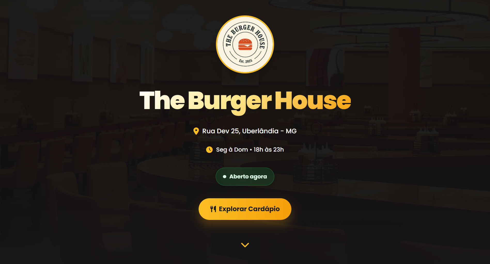
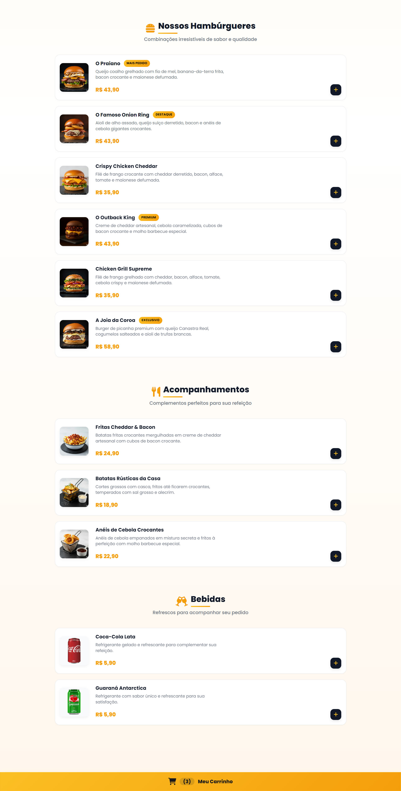
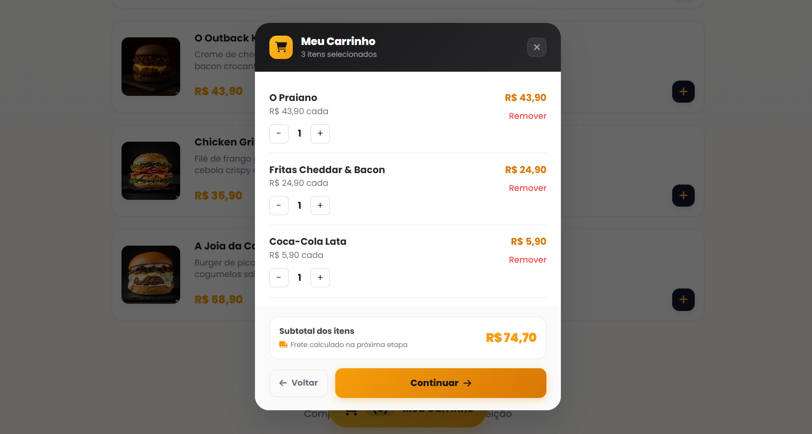
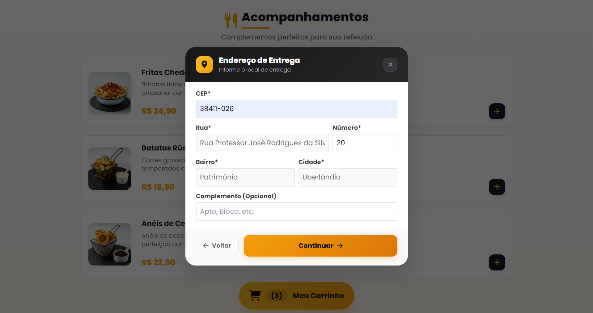
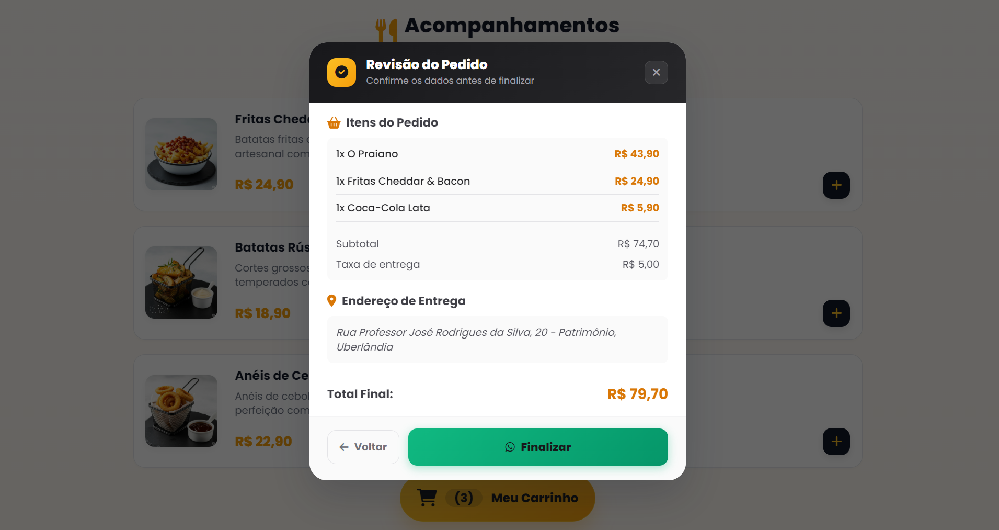

[](https://github.com/felipe-frc/burger-shop/actions/workflows/frontend-ci.yml)

# 🍔 The Burger House

Aplicação web de cardápio digital para hamburgueria, com carrinho interativo, validação de pedidos, integração com WhatsApp e foco em experiência do usuário.

---

## 🌐 Acesse o Projeto

👉 https://burger-shop-aiib.vercel.app/

---

## 📌 Objetivo do Projeto

Este projeto foi desenvolvido com o objetivo de praticar e demonstrar habilidades em desenvolvimento front-end, incluindo:

* construção de interfaces modernas e responsivas;
* manipulação do DOM com JavaScript puro;
* gerenciamento de estado do carrinho;
* persistência de dados com localStorage;
* integração com APIs externas (ViaCEP);
* foco em UX/UI aplicado a sistemas reais de delivery.

---

## 🚀 Funcionalidades

* 📋 Exibição de cardápio por categorias (Hambúrgueres, Acompanhamentos e Bebidas)
* 🛒 Adição e remoção de produtos no carrinho
* ➕ Controle de quantidade de itens
* 💾 Persistência do carrinho com localStorage
* 🚫 Validação de carrinho vazio antes de prosseguir
* 📍 Etapa de preenchimento de endereço
* 🔎 Busca automática de endereço via CEP (ViaCEP)
* 📦 Revisão completa do pedido
* 📲 Envio do pedido diretamente para o WhatsApp
* ⏰ Status dinâmico da loja (Aberto / Fechado)
* 🎨 Feedback visual com animações e notificações (Toast)

---

## 🛠️ Tecnologias Utilizadas

* HTML5
* CSS3
* JavaScript (Vanilla JS)
* Tailwind CSS
* Toastify
* Font Awesome
* API ViaCEP
* localStorage

---

## 🏗️ Estrutura do Projeto

```
burger-shop/
│
├── index.html          # Estrutura principal da aplicação
├── script.js           # Lógica do sistema (carrinho, validações e fluxo do pedido)
├── styles/
│   └── style.css       # Estilos customizados
├── assets/             # Imagens e recursos visuais
└── package.json        # Configuração do projeto
```

---

## ⚙️ Organização da Aplicação

A aplicação foi estruturada com separação de responsabilidades:

* **Interface (HTML):** estrutura visual da aplicação
* **Estilização (CSS/Tailwind):** layout e identidade visual
* **Lógica (JavaScript):** gerenciamento do carrinho, validações e fluxo do pedido
* **Recursos:** imagens e assets

---

## ⭐ Diferenciais Técnicos

* Persistência do carrinho utilizando localStorage
* Fluxo completo de pedido com integração ao WhatsApp
* Integração com API externa para preenchimento automático de endereço
* Feedback visual com animações e notificações
* Interface responsiva para diferentes dispositivos
* Foco em experiência do usuário (UX)

---

## 📸 Interface do Sistema

### 🏠 Página Inicial

<p align="center">
  
</p>

### 🍔 Cardápio

<p align="center">
  
</p>

### 🛒 Carrinho

<p align="center">
  
</p>

### 📍 Endereço

<p align="center">
  
</p>

### 📦 Revisão do Pedido

<p align="center">
  
</p>

---

## ▶️ Como Executar o Projeto

### 1. Clonar o repositório

```bash
git clone https://github.com/felipe-frc/burger-shop.git
```

### 2. Acessar a pasta do projeto

```bash
cd burger-shop
```

### 3. Instalar dependências

```bash
npm install
```

### 4. Executar o projeto

```bash
npm run dev
```

---

## ⚠️ Observações

* O envio de pedidos depende do WhatsApp Web
* A busca de endereço depende da API ViaCEP
* É necessário acesso à internet para carregamento de recursos externos

---

## 🧠 Decisões de Desenvolvimento

Durante o desenvolvimento deste projeto, algumas decisões técnicas foram tomadas para garantir melhor organização, desempenho e experiência do usuário:

- **Uso de localStorage:** utilizado para persistir o carrinho de compras, garantindo que os itens não sejam perdidos ao atualizar a página;
- **Separação de responsabilidades:** divisão clara entre estrutura (HTML), estilização (CSS/Tailwind) e lógica (JavaScript);
- **Validações no front-end:** implementação de validações para impedir ações inválidas, como finalizar pedido com carrinho vazio;
- **Integração com ViaCEP:** automatização do preenchimento de endereço para melhorar a experiência do usuário;
- **Fluxo de pedido estruturado:** organização em etapas (carrinho → endereço → revisão) simulando um sistema real de delivery;
- **Feedback visual:** uso de animações e notificações para tornar a interação mais intuitiva e agradável;
- **Controle de horário da loja:** lógica para simular funcionamento real (aberto/fechado).

Essas decisões foram pensadas para aproximar o projeto de um cenário real de aplicação web.

---

## 📈 Melhorias Futuras

* Integração com backend para gerenciamento de pedidos
* Sistema de autenticação de usuários
* Painel administrativo
* Integração com banco de dados

---

## 📄 Licença

Este projeto está sob a licença MIT.

---

## 👨‍💻 Autor

**Felipe França** 
