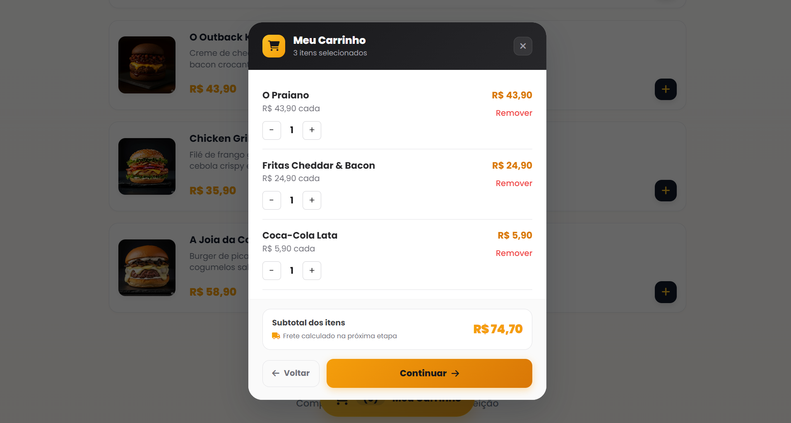

[](https://github.com/felipe-frc/the-burger-house/actions)

[](https://burger-shop-aiib.vercel.app/)


# 🍔 The Burger House

Aplicação web de cardápio digital para hamburgueria desenvolvida com **HTML5**, **JavaScript Vanilla**, **Tailwind CSS** e **Vite**, com foco em arquitetura front-end, manipulação do DOM, gerenciamento de estado, integração com API externa, acessibilidade, testes automatizados, performance, segurança e experiência do usuário.

O projeto simula um fluxo real de pedidos: o cliente navega pelo cardápio, adiciona produtos ao carrinho, escolhe entre **entrega ou retirada no local**, consulta automaticamente o endereço pelo CEP, revisa o pedido e finaliza o atendimento diretamente pelo WhatsApp.

Além das funcionalidades visíveis, o projeto possui uma base técnica preparada para portfólio profissional, com **JavaScript modular**, separação entre regras de negócio e interface, testes unitários e E2E, auditorias automatizadas de acessibilidade, quality gates de cobertura, lint, formatação, typecheck, CI/CD, otimização de performance e validação de segurança das dependências.

---

## 🔗 Links Rápidos

- 🌐 **Deploy:** [The Burger House na Vercel](https://burger-shop-aiib.vercel.app/)

- 📂 **Repositório:** [github.com/felipe-frc/the-burger-house](https://github.com/felipe-frc/the-burger-house)

- 🧪 **Actions:** [GitHub Actions](https://github.com/felipe-frc/the-burger-house/actions)

- 📦 **Releases:** [Histórico de versões](https://github.com/felipe-frc/the-burger-house/releases)

> 🚀 A aplicação está publicada na **Vercel** e recebe novos deploys a partir das atualizações enviadas para a branch `main`.

---

## 📌 Objetivo do Projeto

O **The Burger House** foi criado para demonstrar, em um projeto front-end completo de portfólio, conhecimentos práticos em desenvolvimento web moderno sem depender de frameworks JavaScript.

O projeto cobre desde a interface até qualidade, automação e publicação, incluindo:

- desenvolvimento com **HTML5**, **CSS3** e **JavaScript Vanilla**;

- modularização com ES Modules;

- manipulação do DOM;

- renderização dinâmica de produtos;

- separação entre regra de negócio e interface;

- gerenciamento de estado;

- persistência com `localStorage`;

- integração com a API **ViaCEP**;

- tratamento de erros de integração;

- validações de formulário;

- internacionalização em Português e Inglês;

- acessibilidade e navegação por teclado;

- testes automatizados com **Vitest**;

- testes E2E com **Playwright**;

- auditorias de acessibilidade com **axe-core**;

- cobertura de código com **Vitest Coverage V8**;

- quality gates de cobertura;

- lint com **ESLint**;

- formatação com **Prettier**;

- verificação de tipos em JavaScript;

- build de produção com **Vite**;

- otimização de performance;

- SEO técnico;

- validação de segurança com `npm audit`;

- integração contínua com **GitHub Actions**;

- deploy com **Vercel**;

- documentação técnica para portfólio profissional.

---

## ⭐ Destaques Técnicos

- Arquitetura JavaScript organizada em módulos por responsabilidade;

- regras de negócio do carrinho isoladas em `cart-service.js`;

- estado compartilhado centralizado em `state.js`;

- integração ViaCEP isolada em `scripts/services/viacep-service.js`;

- renderização dinâmica do cardápio;

- persistência do carrinho e idioma no `localStorage`;

- fluxo completo de entrega e retirada;

- internacionalização inicial em Português e Inglês;

- tratamento de CEP inválido e falhas de rede;

- navegação acessível em modais com focus trap;

- auditorias automatizadas de acessibilidade com axe-core;

- **60 testes automatizados passando**;

- **22 execuções E2E passando em desktop e mobile**;

- cobertura protegida por thresholds mínimos;

- lint com ESLint;

- formatação validada com Prettier;

- typecheck aplicado ao JavaScript;

- build de produção com Vite;

- CI dividido em quality, build e E2E;

- logo principal otimizada de aproximadamente **1,56 MB para cerca de 8 KB**;

- Lighthouse Mobile com **95 em Performance**;

- Lighthouse com **100 em Accessibility**;

- Lighthouse com **100 em Best Practices**;

- Lighthouse com **100 em SEO**;

- `robots.txt` válido;

- dependências revisadas com **0 vulnerabilidades no npm audit**.

---

## 🚀 Funcionalidades

### 🍔 Cardápio

- Exibição do cardápio separado por categorias;

- categorias de Hambúrgueres, Acompanhamentos e Bebidas;

- renderização dinâmica dos produtos via JavaScript;

- dados centralizados em módulo próprio;

- imagens, descrições e preços;

- tags de destaque por produto;

- navegação rápida por categorias;

- animações de entrada durante o scroll;

- tradução dinâmica dos dados do cardápio.

### 🛒 Carrinho

- Adição de produtos;

- remoção de produtos;

- incremento de quantidade;

- decremento de quantidade;

- remoção automática quando a quantidade chega a zero;

- cálculo automático do subtotal;

- cálculo da taxa de entrega;

- cálculo do total final;

- persistência do carrinho no `localStorage`;

- validação de carrinho vazio;

- indicador visual de produtos adicionados;

- feedback com toast;

- regras principais isoladas em `cart-service.js`.

### 🚚 Entrega ou Retirada

O cliente pode selecionar a forma de recebimento antes de continuar o checkout.

#### 🚚 Entrega

- mantém a taxa de entrega;

- direciona o cliente para o formulário de endereço;

- exige dados válidos antes da revisão.

#### 🏪 Retirada no Local

- pula o preenchimento do endereço;

- remove automaticamente a taxa de entrega;

- direciona diretamente para a revisão do pedido.

### 📍 Endereço de Entrega

- consulta automática pelo CEP;

- integração com a API ViaCEP;

- preenchimento automático de rua;

- preenchimento automático de bairro;

- preenchimento automático de cidade;

- validação de CEP;

- tratamento de CEP inexistente;

- tratamento de falha de rede;

- validação do número do endereço;

- indicação visual de campos preenchidos automaticamente;

- mensagens de erro acessíveis.

### 📦 Revisão do Pedido

A etapa de revisão apresenta:

- produtos selecionados;

- quantidade de cada item;

- subtotal;

- taxa de entrega;

- total final;

- tipo de pedido;

- endereço quando aplicável;

- campo opcional de observações;

- botão de finalização.

### 💬 Finalização via WhatsApp

O pedido final é transformado em uma mensagem estruturada contendo os dados necessários para atendimento.

Após a finalização:

- a mensagem é enviada para o WhatsApp;

- o carrinho é limpo;

- os dados persistidos do pedido são atualizados;

- a aplicação fica pronta para um novo pedido.

### 🌎 Internacionalização

- suporte inicial a Português;

- suporte inicial a Inglês;

- seletor de idioma;

- persistência da preferência no `localStorage`;

- tradução dos principais textos da interface;

- tradução do cardápio renderizado dinamicamente;

- atualização da interface ao trocar o idioma;

- testes automatizados para a camada de internacionalização.

### 🕒 Status da Loja

- status **Aberto / Fechado** calculado dinamicamente;

- horário baseado nas configurações da loja;

- atualização visual do estado apresentado ao cliente.

---

## ♿ Acessibilidade

A acessibilidade faz parte tanto da implementação quanto dos testes automatizados do projeto.

Entre os recursos disponíveis estão:

- `aria-live`;

- `aria-modal`;

- `aria-describedby`;

- `role="alert"` em mensagens importantes;

- textos alternativos para imagens;

- gerenciamento de foco em modais;

- focus trap;

- foco automático ao abrir modal;

- fechamento pela tecla `Esc`;

- fechamento pelo overlay;

- navegação por teclado;

- contraste revisado em elementos importantes.

### 🧪 Auditorias Automatizadas

O projeto utiliza **axe-core integrado ao Playwright**.

São auditados automaticamente:

- página inicial;

- modal do carrinho;

- formulário de endereço;

- revisão do pedido.

As verificações utilizam regras relacionadas a:

- WCAG 2.0 A;

- WCAG 2.0 AA;

- WCAG 2.1 A;

- WCAG 2.1 AA.

---

## 🛠️ Tecnologias

| Camada                      | Tecnologia                     |

| --------------------------- | ------------------------------ |

| Estrutura                   | HTML5                          |

| Linguagem                   | JavaScript ES6+                |

| Estilização                 | Tailwind CSS + CSS customizado |

| Build / Dev Server          | Vite                           |

| Persistência                | localStorage                   |

| API de endereço             | ViaCEP                         |

| Notificações                | Toastify JS                    |

| Ícones                      | Font Awesome                   |

| Tipografia                  | Google Fonts                   |

| Testes                      | Vitest                         |

| Cobertura                   | Vitest Coverage V8             |

| Testes E2E                  | Playwright                     |

| Acessibilidade automatizada | axe-core                       |

| Ambiente de testes          | jsdom                          |

| Lint                        | ESLint                         |

| Formatação                  | Prettier                       |

| Typecheck                   | TypeScript `checkJs`           |

| CI/CD                       | GitHub Actions                 |

| Deploy                      | Vercel                         |

| Versionamento               | Git / GitHub                   |

---

## 🏗️ Estrutura do Projeto

```txt

the-burger-house/

│

├── .github/

│   └── workflows/

│       └── frontend-ci.yml              # Pipeline de CI

│

├── assets/

│   ├── optimized/

│   │   └── logo-burger.webp             # Logo otimizada da hero

│   └── ...                               # Demais recursos visuais

│

├── docs/

│   └── images/

│       ├── home.png

│       ├── cardapio.png

│       ├── cart.png

│       ├── pedido.png

│       ├── endereco.png

│       └── revisao.png

│

├── public/

│   └── robots.txt                        # Regras públicas para crawlers

│

├── scripts/

│   ├── services/

│   │   └── viacep-service.js             # Comunicação com a API ViaCEP

│   │

│   ├── address.js                        # Formulário e regras de endereço

│   ├── cart-service.js                   # Regras de negócio do carrinho

│   ├── cart.js                           # Interface e eventos do carrinho

│   ├── config.js                         # Configurações gerais

│   ├── data.js                           # Produtos e dados do cardápio

│   ├── i18n.js                           # Internacionalização

│   ├── main.js                           # Inicialização da aplicação

│   ├── order.js                          # Revisão e finalização do pedido

│   ├── state.js                          # Estado compartilhado

│   ├── ui.js                             # Interface, modais e navegação

│   └── utils.js                          # Funções utilitárias

│

├── styles/

│   └── style.css                         # Fonte principal dos estilos

│

├── tests/

│   ├── e2e/

│   │   ├── accessibility.e2e.js          # E2E de acessibilidade

│   │   └── checkout.e2e.js               # E2E dos fluxos de pedido

│   │

│   ├── address.test.js

│   ├── cart-service.test.js

│   ├── cart.test.js

│   ├── data.test.js

│   ├── i18n.test.js

│   ├── main.test.js

│   ├── order.test.js

│   ├── ui-extended.test.js

│   ├── ui.test.js

│   ├── utils.test.js

│   └── viacep-service.test.js

│

├── .gitignore

├── .prettierignore

├── .prettierrc.json

├── eslint.config.js

├── index.html

├── jsconfig.json

├── LICENSE

├── package.json

├── package-lock.json

├── playwright.config.js

├── README.md

├── tailwind.config.js

└── vercel.json

```

---

## 📸 Interface do Sistema

### 🏠 Página Inicial

Tela inicial com hero section, identidade visual da hamburgueria, informações de atendimento e status dinâmico da loja.


---

### 🍔 Cardápio

Produtos organizados por categorias, com imagem, descrição, preço, destaque e botão para adicionar ao carrinho.


---

### 🛒 Carrinho

Modal responsável pela edição do pedido antes do checkout, incluindo quantidade, subtotal, taxa e total.



---

### 🚚 Tipo de Pedido

Etapa em que o cliente escolhe entre **Entrega** ou **Retirada no local**.


---

### 📍 Endereço de Entrega

Formulário com consulta automática do CEP, preenchimento assistido e validações.


---

### 📦 Revisão do Pedido

Resumo final contendo produtos, valores, tipo de pedido, endereço e observações antes da finalização.


---

## ⚙️ Como Executar o Projeto

### Pré-requisitos

- Node.js 20 ou superior;

- npm;

- Git instalado.

---

### 1. Clone o repositório

```bash

git clone https://github.com/felipe-frc/the-burger-house.git

```

---

### 2. Acesse a pasta

```bash

cd the-burger-house

```

---

### 3. Instale as dependências

Para uma instalação reprodutível utilizando o `package-lock.json`:

```bash

npm ci

```

Durante o desenvolvimento, também é possível utilizar:

```bash

npm install

```

---

### 4. Execute o ambiente de desenvolvimento

```bash

npm run dev

```

O comando inicia simultaneamente:

- Tailwind CSS em modo watch;

- servidor de desenvolvimento do Vite.

Após iniciar, o terminal exibirá uma URL local semelhante a:

```txt

http://localhost:5173

```

Abra o endereço no navegador.

---

### 5. Gere o build de produção

```bash

npm run build

```

O Vite gera os arquivos finais dentro de:

```txt

dist/

```

---

### 6. Visualize o build de produção

```bash

npm run preview

```

---

### 7. Execute o lint

```bash

npm run lint

```

---

### 8. Verifique a formatação

```bash

npm run format:check

```

---

### 9. Execute o typecheck

```bash

npm run typecheck

```

---

### 10. Execute os testes

```bash

npm test

```

---

### 11. Execute os testes com cobertura

```bash

npm run test:coverage

```

---

### 12. Execute os testes E2E

Desktop e mobile:

```bash

npm run e2e

```

Somente mobile:

```bash

npx playwright test --project=mobile-chromium

```

---

### 13. Execute a auditoria de segurança

```bash

npm audit

```

---

## ✅ Qualidade e Testes

O projeto possui diferentes camadas de validação para proteger regras de negócio, interface, integrações e fluxos completos do usuário.

### 📊 Estado Atual

| Métrica                  | Resultado |

| ------------------------ | --------: |

| Arquivos de teste Vitest |    **11** |

| Testes automatizados     |    **60** |

| Testes com falha         |     **0** |

| E2E desktop              | **11/11** |

| E2E mobile               | **11/11** |

| Execuções E2E totais     | **22/22** |

| Vulnerabilidades npm     |     **0** |

### 📈 Cobertura

| Métrica    | Cobertura Atual | Quality Gate |

| ---------- | --------------: | -----------: |

| Statements |      **75.63%** |          75% |

| Branches   |      **58.81%** |          55% |

| Functions  |      **85.62%** |          80% |

| Lines      |      **78.89%** |          75% |

Caso a cobertura fique abaixo dos limites definidos, o workflow de CI falha automaticamente.

### 🧪 Testes com Vitest

A suíte cobre componentes e módulos como:

- `address.js`;

- `viacep-service.js`;

- `cart-service.js`;

- `cart.js`;

- `data.js`;

- `i18n.js`;

- `main.js`;

- `order.js`;

- `ui.js`;

- `utils.js`.

Entre os cenários validados estão:

- consistência dos dados do cardápio;

- formatação de preços;

- escape de HTML;

- regras do carrinho;

- quantidade de produtos;

- subtotal;

- taxa de entrega;

- total final;

- estado da interface;

- inicialização da aplicação;

- internacionalização;

- endereço;

- ViaCEP;

- revisão do pedido.

### 🎭 Testes E2E com Playwright

A suíte possui **11 cenários por projeto de navegador**.

Os cenários são executados em:

- Chromium Desktop;

- Chromium Mobile com perfil Pixel 5.

Os testes de checkout validam:

- fluxo completo de compra com entrega;

- retirada no local sem endereço;

- CEP inválido;

- bloqueio quando o carrinho fica vazio;

- troca de idioma;

- observações longas;

- remoção de produto antes da revisão.

Os testes de acessibilidade validam:

- página inicial;

- carrinho;

- formulário de endereço;

- revisão do pedido.

---

## 🚀 Performance, Acessibilidade e SEO

O projeto foi auditado com **Google Lighthouse** em Chrome Incognito utilizando perfil Mobile.

### 📊 Resultado Atual

| Categoria      | Pontuação |

| -------------- | --------: |

| Performance    |    **95** |

| Accessibility  |   **100** |

| Best Practices |   **100** |

| SEO            |   **100** |

### ⚡ Métricas de Performance

| Métrica                  | Resultado |

| ------------------------ | --------: |

| First Contentful Paint   | **1.7 s** |

| Largest Contentful Paint | **2.7 s** |

| Total Blocking Time      | **10 ms** |

| Cumulative Layout Shift  | **0.008** |

| Speed Index              | **1.9 s** |

### 🖼️ Otimização da Logo

A imagem principal da hero originalmente possuía aproximadamente:

```txt

1.56 MB

```

Após otimização:

```txt

\~8 KB

```

A alteração contribuiu para a evolução de:

```txt

Performance: 74 → 95

LCP:        10.6 s → 2.7 s

```

### 🔎 SEO

Entre as melhorias aplicadas estão:

- `meta description`;

- Open Graph com asset otimizado;

- `robots.txt` válido;

- imagens com dimensões definidas;

- textos alternativos;

- estrutura semântica;

- otimização da mídia principal.

---

## 🔁 CI/CD

O projeto possui pipeline de integração contínua configurada com **GitHub Actions**.

A pipeline está dividida em três jobs.

### 🧪 Quality

Executa:

```bash

npm ci

npm audit

npm run lint

npm run format:check

npm run typecheck

npm run test:coverage

```

A etapa de qualidade também executa `npm audit`, fazendo com que vulnerabilidades conhecidas nas dependências sejam detectadas automaticamente pelo CI antes das etapas de build e E2E.

O relatório de cobertura também é publicado como artifact temporário da execução.

### 🏗️ Build

Após a conclusão da etapa de qualidade:

```bash

npm ci

npm run build

```

O build só é executado quando o job anterior termina com sucesso.

### 🎭 E2E

Depois do build, o workflow:

1. instala as dependências;

2. instala o Chromium utilizado pelo Playwright;

3. gera o build de produção;

4. inicia o servidor Vite;

5. aguarda o servidor responder;

6. executa os testes E2E;

7. valida desktop e mobile.

Isso garante que alterações enviadas ao repositório sejam verificadas antes de serem consideradas estáveis.

---

## 🔐 Segurança

A árvore de dependências é validada com:

```bash
npm audit
```

Estado atual:

```txt
found 0 vulnerabilities
```

A auditoria de dependências também faz parte do job **Quality** do GitHub Actions.

Isso significa que, além da validação local, novas alterações enviadas ao repositório passam automaticamente por:

```bash
npm audit
```

Caso sejam detectadas vulnerabilidades conhecidas nas dependências, o job de qualidade falha antes das etapas de build e E2E.

Durante o fechamento da versão atual, as dependências vulneráveis foram atualizadas de forma controlada, sem utilização de `--force`.

Após as atualizações, foram executados novamente:

- `npm audit`;
- lint;
- Prettier;
- typecheck;
- testes com cobertura;
- build;
- E2E desktop;
- E2E mobile.

Todos permaneceram funcionando corretamente.

---

## ⚠️ Observações

- A consulta de endereço depende da disponibilidade da API ViaCEP;

- é necessário acesso à internet para consulta real de CEP;

- a finalização depende da abertura do WhatsApp;

- o carrinho é persistido no `localStorage`;

- a preferência de idioma também é persistida no navegador;

- o diretório `coverage/` é gerado localmente e não deve ser versionado;

- relatórios do Playwright são temporários e não fazem parte do código-fonte;

- o `output.css` é um artefato gerado pelo processo de desenvolvimento/build;

- a fonte principal dos estilos permanece em `styles/style.css`.

---

## 🧠 Decisões de Desenvolvimento

### JavaScript Vanilla

O projeto foi mantido sem framework JavaScript para aprofundar conceitos fundamentais da linguagem, manipulação do DOM, módulos ES, gerenciamento de estado, eventos e separação de responsabilidades.

### Vite como Ferramenta de Desenvolvimento e Build

O Vite foi adotado para modernizar o fluxo de desenvolvimento, fornecer servidor local rápido e gerar um build de produção otimizado.

### Modularização do JavaScript

A aplicação foi dividida em módulos responsáveis por:

- dados;

- carrinho;

- regra de negócio;

- estado;

- interface;

- endereço;

- integração externa;

- internacionalização;

- pedido;

- utilitários.

Essa organização reduz arquivos monolíticos e melhora manutenção e testabilidade.

### Separação das Regras do Carrinho

As regras do carrinho foram extraídas para `cart-service.js`.

Com isso, operações como adicionar, remover, incrementar, decrementar, calcular subtotal, taxa e total podem ser testadas sem depender da interface.

### Estado Centralizado

O módulo `state.js` concentra o estado compartilhado da aplicação e sua persistência.

Essa abordagem evita acessos ao `localStorage` espalhados por diferentes módulos.

### Integração ViaCEP em Service Próprio

A comunicação com a API ViaCEP foi isolada em:

```txt

scripts/services/viacep-service.js

```

Dessa forma, a responsabilidade de rede fica separada da lógica do formulário.

### Internacionalização

A camada de internacionalização concentra os textos e permite alterar dinamicamente a interface entre Português e Inglês.

A preferência selecionada é persistida entre sessões.

### Acessibilidade Automatizada

Além de aplicar boas práticas diretamente na interface, o projeto utiliza axe-core junto ao Playwright para verificar automaticamente violações conhecidas de acessibilidade.

### Testes em Camadas

A estratégia atual combina:

- testes unitários;

- testes de integração com DOM;

- E2E;

- auditorias de acessibilidade.

Isso amplia a proteção contra regressões.

### Quality Gates de Cobertura

Os thresholds transformam a cobertura em uma regra automatizada de qualidade.

Se uma alteração fizer a cobertura cair abaixo dos limites definidos, o CI falha.

### ESLint + Prettier + Typecheck

Essas ferramentas foram adicionadas para proteger diferentes aspectos da base:

- ESLint → qualidade e padrões do JavaScript;

- Prettier → consistência de formatação;

- Typecheck → detecção antecipada de erros estruturais em JavaScript.

### CI/CD com GitHub Actions

A pipeline automatiza qualidade, auditoria de segurança, testes, build e E2E, aproximando o projeto de um fluxo profissional de desenvolvimento.

### Deploy na Vercel

A aplicação é publicada na Vercel e permanece sincronizada com o código enviado para o repositório.

---

## 🧾 Releases

| Versão                                                                       | Destaque                                                                                      |

| ---------------------------------------------------------------------------- | --------------------------------------------------------------------------------------------- |

| **v2.7.0**                                                                   | Hardening técnico, 60 testes, E2E desktop/mobile, acessibilidade, Lighthouse, SEO e segurança |

| [v2.6.0](https://github.com/felipe-frc/the-burger-house/releases/tag/v2.6.0) | Testes E2E com Playwright                                                                     |

| [v2.5.0](https://github.com/felipe-frc/the-burger-house/releases/tag/v2.5.0) | Refatoração do carrinho e cobertura de testes                                                 |

| [v2.4.1](https://github.com/felipe-frc/the-burger-house/releases/tag/v2.4.1) | Documentação, CI e otimização da logo                                                         |

| [v2.4.0](https://github.com/felipe-frc/the-burger-house/releases/tag/v2.4.0) | Internacionalização inicial                                                                   |

| [v2.3.0](https://github.com/felipe-frc/the-burger-house/releases/tag/v2.3.0) | Testes automatizados com Vitest                                                               |

| v2.2.2                                                                       | Correções de consistência estrutural                                                          |

| v2.2.1                                                                       | Melhorias de SEO e performance                                                                |

| v2.2.0                                                                       | Retirada no local e melhorias no carrinho                                                     |

| v2.1.0                                                                       | Campo de observações no pedido                                                                |

| v2.0.0                                                                       | Melhorias de navegação e UX                                                                   |

| v1.3.0                                                                       | Acessibilidade e experiência nos modais                                                       |

| v1.2.1                                                                       | Correções de CI e produção                                                                    |

| v1.2.0                                                                       | Correções no formulário de endereço                                                           |

| v1.1.0                                                                       | Refatoração estrutural                                                                        |

| v1.0.0                                                                       | Primeira versão estável                                                                       |

> A release `v2.7.0` será publicada após a validação final desta versão.

---

## 📈 Melhorias Futuras

- adicionar busca de produtos;

- adicionar filtros no cardápio;

- permitir observações específicas por item;

- calcular entrega por região ou faixa de CEP;

- integrar backend para persistência de pedidos;

- adicionar autenticação;

- criar painel administrativo;

- integrar banco de dados;

- criar histórico de pedidos;

- adicionar acompanhamento do status do pedido.

---

## 📄 Licença

Este projeto está sob a licença MIT. Veja o arquivo [LICENSE](LICENSE) para mais detalhes.

---

## 👨🏻‍💻 Autor

**Marcos Felipe França**

[LinkedIn](https://www.linkedin.com/in/marcosfelipefrc) · [GitHub](https://github.com/felipe-frc)
